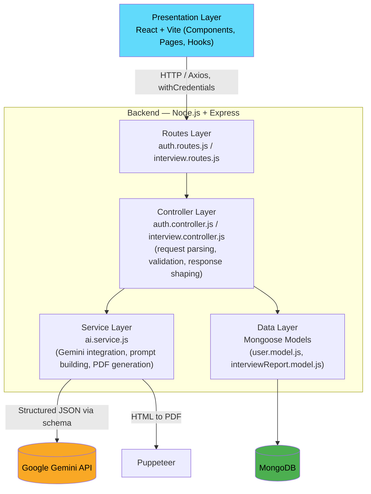
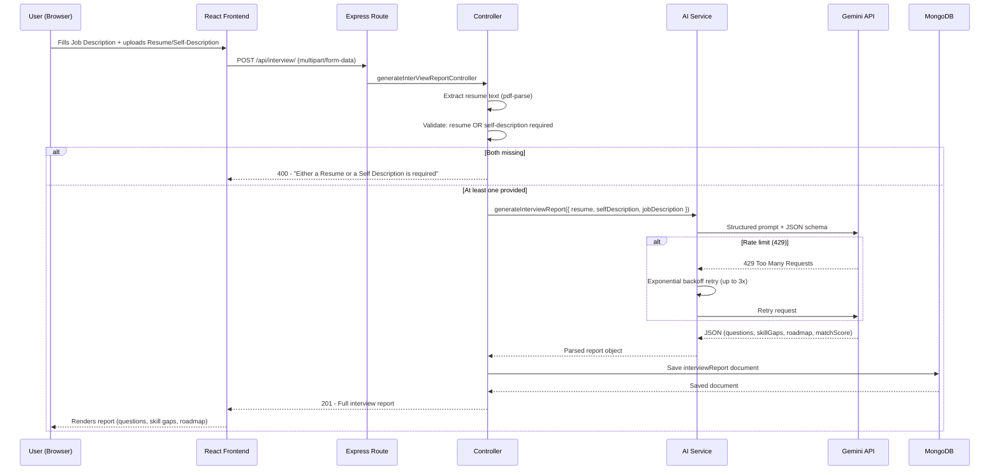

# Interview-Prep-Ai

An AI-powered interview preparation platform that analyzes your resume and a target job description to generate personalized technical & behavioral interview questions, skill-gap analysis, a day-wise preparation roadmap, and a tailored, AI-rewritten resume — all in one place.


---

## Table of Contents

- [Features](#features)
- [Architecture](#architecture)
- [Request Flow](#request-flow)
- [Tech Stack](#tech-stack)
- [Getting Started](#getting-started)
- [API Documentation](#api-documentation)
- [Roadmap](#roadmap)

---

## Features

- **Personalized Interview Report** — Upload a resume (PDF), paste a job description, and/or add a quick self-description to get:
  - Technical & behavioral interview questions (with intention + model answers)
  - Match score against the job description
  - Skill-gap analysis with severity ratings
  - A day-wise preparation roadmap
- **AI-Tailored Resume Generation** — Rewrites your resume to align with a job description, using only facts already present in the original (no hallucinated content), exported as a downloadable PDF.
- **Secure Authentication** — JWT-based auth with httpOnly cookies and bcrypt password hashing.
- **Report History** — Revisit any previously generated interview report.

---

## Architecture

The backend follows a **4-layer architecture**, separating concerns so each layer only knows about the one directly below it:



**Layer responsibilities:**

| Layer | Responsibility |
|---|---|
| **Presentation** | React UI — forms, dropzone, report display, auth pages |
| **Routes** | Maps HTTP endpoints to controller functions, applies auth middleware |
| **Controller** | Validates input, orchestrates service calls, shapes the HTTP response |
| **Service** | Business logic — resume text extraction, Gemini prompt construction, PDF generation, retry/rate-limit handling |
| **Data** | Mongoose schemas and MongoDB persistence |

---

## Request Flow

Flow for the core "Generate Interview Report" feature:



**Resume Download flow** works similarly, but pulls the saved `resume` / `jobDescription` / `selfDescription` from an existing report in MongoDB, sends it to Gemini for a tailored HTML resume, then converts that HTML to a PDF via **Puppeteer** before streaming it back to the client.

---

## Tech Stack

**Frontend:** React (Vite), React Router, Sass (SCSS), Axios
**Backend:** Node.js, Express.js
**Database:** MongoDB with Mongoose
**AI:** Google Gemini API (structured JSON schema output — no free-form parsing)
**PDF Handling:** `pdf-parse` (resume text extraction), Puppeteer (PDF generation)
**Auth:** JWT, bcrypt, httpOnly cookies
**Tools:** Git, GitHub, Postman, MongoDB Compass, Chrome DevTools

---

## Getting Started

### Prerequisites

- Node.js (v18+)
- MongoDB (local or Atlas)
- A Google Gemini API key

### Installation

```bash
git clone https://github.com/piyushgupta786/Interview-Prep-Ai.git
cd Interview-Prep-Ai

cd BACKEND
npm install

cd ../FRONTEND
npm install
```

### Environment Variables

Create a `.env` file inside `BACKEND/`:


### Running Locally

```bash
# Backend (from BACKEND/)
npm start

# Frontend (from FRONTEND/)
npm run dev
```

Frontend: `http://localhost:5173` · Backend: `http://localhost:3000`

---

## API Documentation

Full endpoint reference (request/response formats, error codes) available in [API_DOCUMENTATION.md](./API_DOCUMENTATION.md).

---

## Roadmap

- [ ] Deploy to production (Render + Vercel + MongoDB Atlas)
- [ ] Redesign login/register UI
- [ ] Add Google email verification
- [ ] Add ATS (Applicant Tracking System) compatibility score check

---

## Author

**Piyush Gupta**
[GitHub](https://github.com/piyushgupta786) · [LinkedIn](www.linkedin.com/in/piyushgupta786)